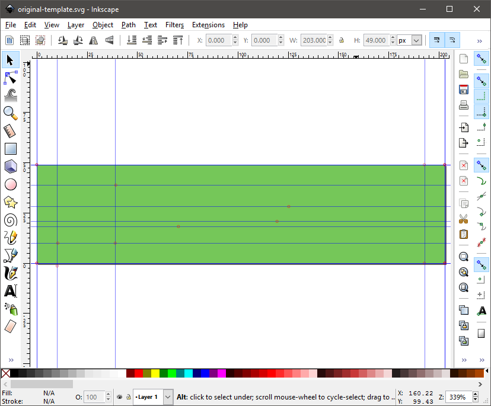
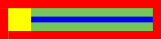
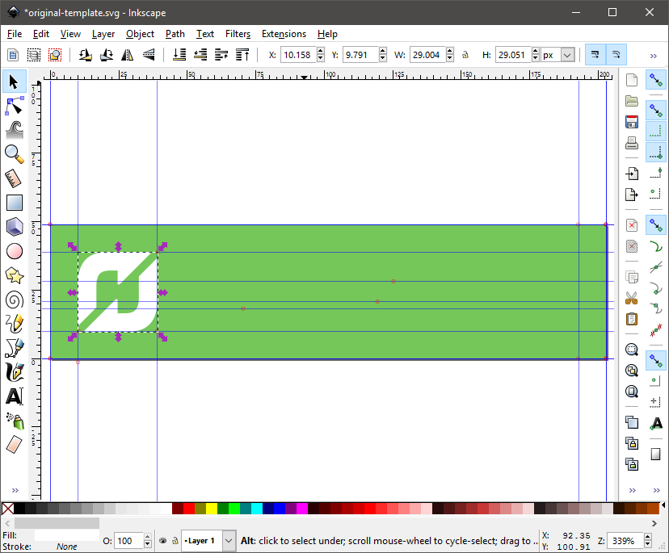
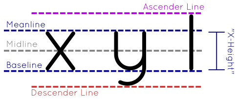
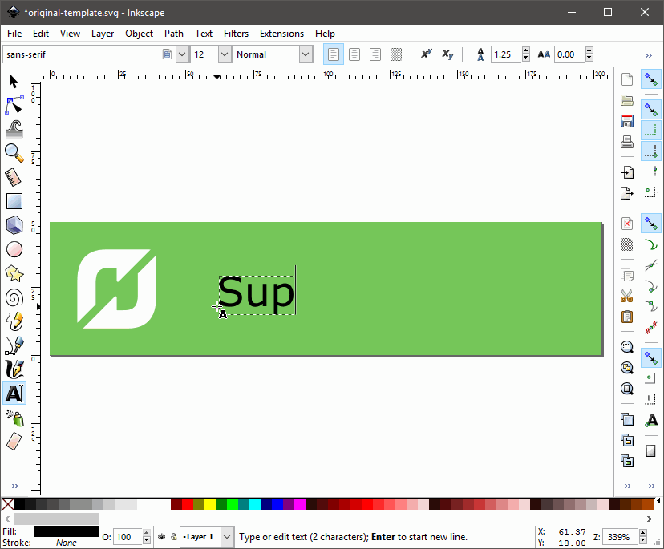
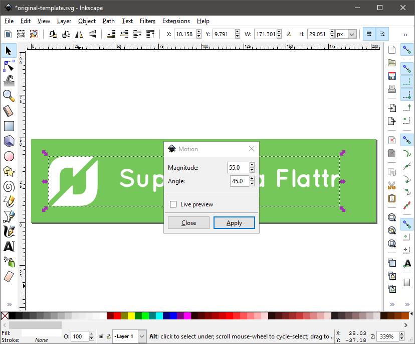
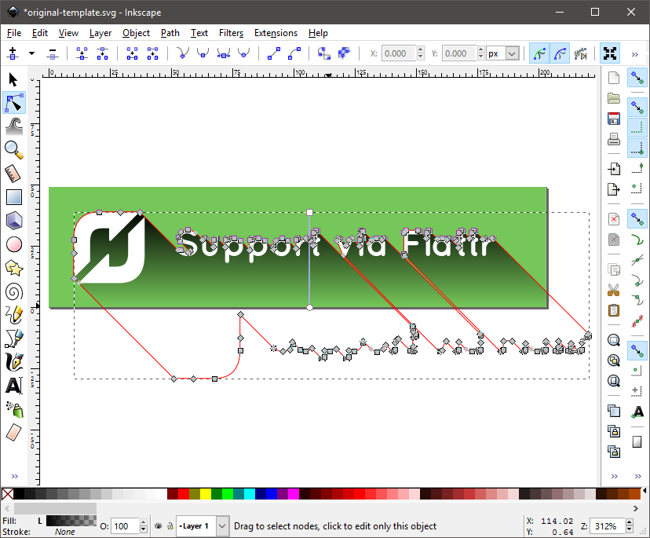
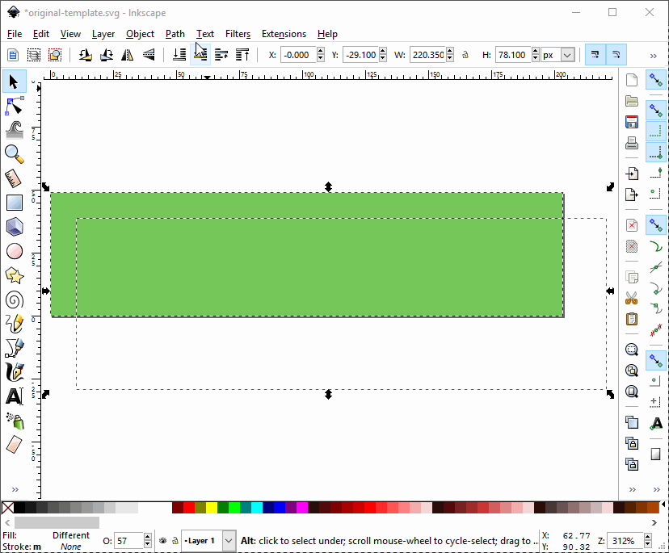
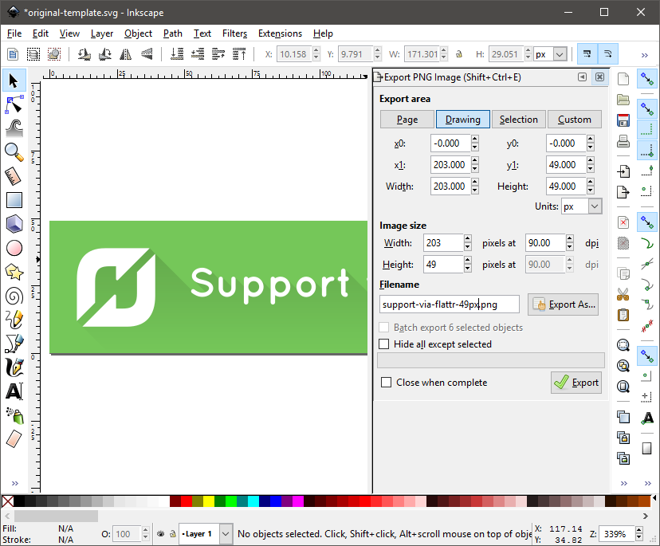

# Open Source Gratitude Buttons

Here is the scenario: you have freely given your time to a free or open source project, you could have spent that time with your family or getting paid real money to for the work you do.  Instead you selflessly built something for someone else to use, it's your users love your work and they want to give something back to you - fortunately this is easy!  A range of "micro-payment" or gratuity services have popped up recently allowing you to accept small donations towards your next cup of coffee - we're never going to get rich from these but waking up to £1/€1/$1 is recognition that the work you do has real value.

Still not convinced? Isaac Z. Schlueter, the developer of `npm` has written a far deeper analysis of the [current open source monetization landscape][8cc429c0].  One final question to consider that may tip you over the edge: would Heartbleed have ever happened if the developers of OpenSSL had felt more valued?

  [8cc429c0]: https://medium.com/open-source-life/money-and-open-source-d44a1953749c#.6uvrik2dc "Isaac Z. Schlueter "Money and Open Source""

# Usage and Instructions

This repository contains a small selection of buttons for you to use in your project pages.  They were borne out of my frustration at the lack of a standard style of buttons to host on my own pages.  Because I believe in the Open Source and Creative Commons community I have licenced these under the [Creative Commons Zero 1.0 Public Domain Dedication][f55741c1].

  [f55741c1]: https://creativecommons.org/publicdomain/zero/1.0/ "CC0 1.0 Universal (CC0 1.0)"

I currently only support [Gratipay][90ed3154] and [Flattr][e2eed536] as these are the services I use for my own work.  You can use the GitHub flavoured markdown below to embed the images in your own `README.md` file, paste in the markup and __remember to change the URLs to your own usernames__.

  [90ed3154]: https://gratipay.com/ "Gratipay"
  [e2eed536]: https://flattr.com/ "Flattr"

## Scalable Vector Graphics (SVGs)

[Scalable Vector Graphics][48aae250] are the smallest file size that will have the lowest impact on your page load times; it is for this reason that using SVG images is the recommended way to include these buttons in your repository. As they are vector images users are able to increase and decrease browser zoom level without losing any image quality.  The only drawback of SVGs is Internet Explorer 8 [does not support][531197f4] the SVG standard.

  [48aae250]: https://en.wikipedia.org/wiki/Scalable_Vector_Graphics "Scalable Vector Graphics"
  [531197f4]: http://caniuse.com/#search=SVG "Can I Use: SVG"

__Markdown__

    

__HTML__

    

__Markdown__

    

__HTML__

    

## Portable Network Graphics

[Portable Network Graphics][b49c66cf] are an image format that has the maximum support across all modern browsers.  They are a type of raster image, which forces browsers to up-scale images when the user zooms in on a page resulting an a noticeable loss of quality.  These images are exported from the SVG files available above so they should be identical in every way at their natural resolutions.

  [b49c66cf]: https://en.wikipedia.org/wiki/Portable_Network_Graphics "Portable Network Graphics (PNGs) Wikipedia Article"

__Markdown__

    

__HTML__

    

__Markdown__

    

__HTML__

    

### Super-size Buttons

If you want really big buttons, then you can use the double size icons to really stand out.

__Markdown__

    

__HTML__

    

# Contributing

I welcome contributions in the form of Pull Requests or just [messages via gitter][80eaa6f5].  There are three primary ways of contributing to these buttons:

  [80eaa6f5]: https://gitter.im/RichardSlater/open-source-gratitude-buttons "Gitter: RichardSlater/open-source-gratitude-buttons"

  1. **Building Buttons** - by adding more buttons to the repository we can support a wider range of services, the one rule is all icons must be submitted under the [Creative Commons 1.0 Zero licence](https://creativecommons.org/choose/zero/) to allow anyone to use them freely.
  2. **Adding Translations** - by adding translations in different languages we reduce the barriers to entry on projects that target non-English speaking audiences.
  3. **Adding Services** - I've started small based upon the gratuity services that I currently use, however there are a large number of services out there.  If you use one and can explain it to me let me know and I will add it to the list.

## Building Buttons

These buttons are designed specifically to fit within a [flat design][24931594], even more specifically they are designed using a particular style of flat design called [long shadow][6042ae29] which adds a subtle definition to an otherwise flat design.

  [24931594]: https://en.wikipedia.org/wiki/Flat_design "Flat Design Wikipedia Article"
  [6042ae29]: http://www.hongkiat.com/blog/long-shadow-design/ "Long Shadow Design – A New Trend? by Thoriq Firdaus"

Fortunately creating these images using the free and open-source software: [Inkscape][c0ac0df8].  If you are more comfortable using another software package such as Adobe Illustrator and are able to export the images in SVG format then please feel free to contribute in that way.  

  [c0ac0df8]: https://inkscape.org/ "Inkscape"

### Step by Step Instructions - __Inkscape 0.91__

To complete this guide you will need to [download Inkscape](https://inkscape.org/en/download/) version 0.91 or later, in addition you will need to download the [Quicksand Font by Andrew Paglinawan](http://www.fontsquirrel.com/fonts/quicksand) and a tool to optimize PNG images such as [PNG Gauntlet](http://pnggauntlet.com/) for Windows, [ImageOptim](https://imageoptim.com/) for OSX or [Trimage](https://github.com/Kilian/Trimage) for Linux.

#### __Step 1:__ Open the Template

A very basic template is available in the `/icons` folder named `original-template.svg` this provides the correct dimensions and background colour to base all buttons from.  First load this template in Inkscape and enable guides by pressing <kbd>shift</kbd><kbd>|</kbd> (Shift and the Pipe Character).

With the guides enabled you can see the image is broken down into several regions:

 - __Red Zone__: the padding around the outside of the button allows the content of the button to "breathe", this is a no-go zone for anything except the button background and the long shadow.
 - __Yellow Zone__: the icon, this should be a pure white version of the icon if at all possible.  If the terms of use stipulate that colour must be used then we must comply.
 - __Blue Zone__: the text area, this should be in the previously mentioned Quicksand Font.  The blue area depicted above represents the [X-height][477492d0] of Quicksand Book size 12, the actual text will ascend above and below the blue area.

  [477492d0]: http://www.typographydeconstructed.com/x-height/ "Type Glossary: X-Height"

#### __Step 2:__ Add an Icon

Ideally we would stick to a pure white (`#FFFFFF`) images, however if the terms of use of a particular service prevent us from removing colour from a logo then we must comply with these requirements.  Images included within the files must be vector images, it is often possible to find SVG versions of logos through media kits or Wikipedia.  Not all logos will fit in within the allocated space however attempt to fit the logo to the height of the Yellow Zone:

Once you are comfortable with the position of the logo you can ungroup the object with <kbd>Ctrl</kbd><kbd>U</kbd> and unify it into a single path with <kbd>Ctrl</kbd><kbd>+</kbd>.

#### __Step 3:__ Add Text

Centering text is not simply a case of centering the resulting object within the Inkscape page, this is because depending upon which letters, techically called glyphs, are used in the text; the shape of the box that Inkscape uses to center the text changes.

This is because certain letters such as `y`, `g` and `q` have portions of the letter which extend below the baseline of text, these are called[ descenders][8483dcb7].  Equally certain other letters such as `l`, `i` and `b` have portions of the character that extend above the height of most of the other letters, this is called [an ascender][c8635de8].

  [c8635de8]: http://www.typographydeconstructed.com/ascender/ "Typography Deconstructed: Ascender"
  [8483dcb7]: http://www.typographydeconstructed.com/descender/ "Typography Deconstructed: Descender"

You may be wondering if this is the case how can we possibly know how to center our text vertically, well actually it is relativly simple:

 1. Take your text and find a font size that will fit within the available space.  Where possible we should aim for as close to 12pt as possible, for some buttons we may need to drop down to 11pt or 10pt to fit all of the text in.
 2. Copy the text into the clipboard or into a handy text file to use later.
 3. Replace the text with the letter `x`, this letter has the interesting property that it has neither an ascender nor a descender which makes it especially useful for centering text, so much so it is termed the [X-Height of a font][33ba52ab].
 4. Using the Align and Distribute toolbox, which you can access by pressing <kbd>Ctrl</kbd><kbd>Shift</kbd><kbd>A</kbd>, align vertically this text block relative to the page.
 5. Restore the original text of the text block, and align it horizantally within the available space.  Ensure that the text has enough space to breathe to the left and right, don't bunch it up too much.

  [33ba52ab]: http://www.typographydeconstructed.com/x-height/ "Typography Deconstructed: X-Height"

    

#### __Step 4:__ Create Long Shadow

Long shadow is relativly easy to create using Inkscape, you will need to convert all of your text objects to paths (<kbd>Ctrl</kbd><kbd>Shift</kbd><kbd>C</kbd>), ungroup everything (<kbd>Ctrl></kbd><kbd>U</kbd>) and union all objects into a single path (<kbd>Ctrl</kbd><kbd>+</kbd>).

 1. Select your newly combined single object, then from the "Extensions" menu select "Generate From Path..." and choose "Motion...".
 2. The magnitude value should be somewhere in the region of `55` and the angle should be `45`, click "Apply" when you are done.

  

 3. Once the Motion extension has completed you will end up with a white long shadow, ungroup this object (<kbd>Ctrl></kbd><kbd>U</kbd>), then select the larger of the two objects.
 4. This object is actually a group of objects, so again ungroup everything (<kbd>Ctrl</kbd><kbd>U</kbd>) and union all objects into a single path (<kbd>Ctrl</kbd><kbd>+</kbd>).
 5. Change the fill of this object to a gradient fill and adjust the gradient so that it runs from pure black (`#000000`) at the top to transparent at the bottom, finally set this object to an opacity value of 15.

  

 6. Tidy up the image by duplicating the background by selecting it then pressing <kbd>Ctrl</kbd><kbd>D</kbd>.
 7. Shift select the long shadow object so that both the duplicated background at the long shadow are selected then select "Path" and "Intersection" or <kbd>Ctrl</kbd><kbd>\*</kbd>.  This will trim the long shadow to the bounds of the button removing any unnesscary parts of the path.

 

#### __Step 5:__ Finishing Up

Your button should look great now, thanks for putting in all of the hard work.  There are a couple more steps required before you can submit a pull request on GitHub:

 1. Remove any extra objects, if you Select All (<kbd>Ctrl</kbd><kbd>A</kbd>) you may find there are some extra invisible objects, there should only be three objects selected:
   - Green Background
   - Graphics Path
   - Long Shadow
 You can rotate through the objects by pressing <kbd>Tab</kbd>, if as you rotate through nothing looks like it is selected press the <kbd>Delete</kbd> button to remove the vestigial object.
 2. If you are creating a brand new button save a copy of this file in the `/icons` folder this will be the un-optimized version that can be used for the source of additional buttons.
 3. Save a **Optimized SVG** copy of the image in the `/icons/<lang>` folder that is appropiate for the language of your button, most buttons are going to be in English so go ahead and save a copy in the `/icons/en-GB` folder.
 4. Export your button using <kbd>Ctrl</kbd><kbd>Shift</kbd><kbd>E</kbd>, ensure you choose to export the "Drawing" with an Image Size of 203px by 49px  

  

 5. Repeat step 4 above however with an Image Size of 406px by 98px, this will be the super size button.
 6. Use a tool such as PNG Gauntlet to optimize both of the exported image, this will typically save 25-30% for each image.

Now your done you can commit all of your work to your GitHub fork and submit a pull requests for inclusion in the project.

## Adding Translations

I strongly beleive that developers should be able to build software for speakers of their native language, whilst I speak a bit of German, Dutch and Swedish I don't believe I am strong enough to find the correct idomatic phrasing to propperly convey the point in any language other than English.

If you would like to submit a translation then please put the appropiate words in a text file in the appropiate folder in the following format:

    English                 German
    Support via Flattr   -> Unterstützung bei Flattr
    Support via Gratipay -> Unterstützung bei Gratipay

Commit this text file to your GitHub fork and submit a pull request, if I have time to complete the button while accepting the pull request then I will do so, otherwise I will simply commit the text file and myself or another maintainer will complete the work as quickly as possible.

## Adding Services

There are numerous solutions that allow for micro-payment to be accepted by project owners, I however only use Flattr and Gratipay if you own a service and are able to construct a URL that allows easy linking from a project page please get in contact with some examples of how your buttons would work and I will attempt to incorporate them into the repository.

## Other Ways to Contribute

Don't feel limited by the options above, if you can contribute advice on user experience, colour theory, button design or any technique that allows individual contributors to get recognition for their work then get in contact through the GitHub Issues section or through Gitter - I'm always open to learn and improve on these icons.
